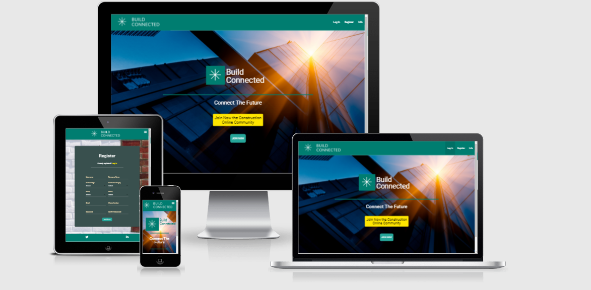

---
# Build Connected
---  

## Website Purpose:
The website aims to connect different professionals subjects in the construction industry.  

---  

Main contractors can register on the website and advertise jobs that need to be carried out by other professionals. All users can also check the contact details of a particular professional to have them price a particular job. All users can add, edit, find or delete jobs that they advertise on the jobs board.
All users can register on the website and check if any job is available in their category, they can perform a search in the jobs database to find jobs that might be available in their county. They can search for jobs from a particular contractor, check if the starting time suits them. Subcontractors once find a job that they are able and interested in carrying out they can apply by sending their availability and price to the contractor that advertises the jobs through the contact form on the website.
All users of the website need to register and provide contact details to use the service. They can also edit or delete their profile.

## Content:
>> [Website Structure](#website-structure)  
>> [User Stories](#user-stories)  
>> [Database Structure](#database-structure)  
>> [Design Choices](#design-choices)   
>> [Wireframes](#wireframes)   
>> [Technologies Used](#technologies-used)   
>> [Implemented Features](#implemented-features)  
>> [Future Features](#future-features) 
>> [Testing](#testing)  
>> [Bugs](#bugs)  
>> [Deployment](#deployment)
>> [Credits](#deployment)  
>> [Acknowledgements](#acknowledgement)

## Website Structure

The website is composed of a landing page that welcomes the user. On the top of the page, there is the navigation bar with the website name on the left and the user options on the right. The login and register links will be there with a third link to provide the user with short information about the purpose of the website and the value of the service provided to the users. At the center of the page the main logo and name of the website with a bigger button to log in/register and enter the website.
At the bottom of the main page links to LinkedIn and Twitter accounts.
The registered user can access his/her profile page where more actions will be displayed in the navigation bar such as jobs options (home, add a new job, my jobs, my profile and log out). The user will be able to edit or delete only the jobs that create and can be found on my jobs page. 
The user will also be able to edit and delete his profile and submit prices for the jobs that he is interested in carrying out.  

*Build Connected Website Structure*

For this project, two collections are created: one for the users (contractors database) and one for the jobs advertised. Both collections are created on mongo db - non-relational database cloud storage.

## User Stories  

Find user stories in a separate document [user-stories.md](./lib/static/docs/user-stories.md)

## Database Structure
Build Connected database is structured in 2 collections:  

### users 
Each user record has the following fields:
* _id
* username  
* company_name
* contractor_type
* categories
* county
* country
* email  
* phone_number  
* password  

The _id field is the ObjectId given when a new user registers  
Contractor_type, categories, county, and country are entered selecting values from dropdown selection elements to keep values format consistent across all records and avoid typo errors from user input.
The email value have to pass the python validator to allow the user to register.  
The phone number accepts numbers only.  
### jobs
Each jobs record has the following fields:  
* job_title  
* category  
* employer  
* contact_phone_number  
* contact_email
* county  
* starting_date  
* urgent  
* description  
* date_job_created  
* created_by  

A single user can add multiple jobs into the jobs collection  
When a user creates a new job record the value for "created_by" and "employer" are given automatically from the user's record (username and company name). For the construction type, categories, county and country the values are chosen from a dropdown selection to keep a consistent format across all records. The email value has to pass the python validator to allow the user to create a job record. Phone number field accepts numbers as input. Starting date is selected with a date picker to keep a consistent format across all records. The field date_job_created will be given by the app with datetime.date.today().

### User Actions:
register  
log in  
add new job  
edit job  
delete job 
edit profile  
edit password  
delete profile  
contact contractor  
contact employer    
log out  
search contractors by:
* name  
* category  
* county 

search jobs by:
* employer 
* category 
* county  

## Design Choices

### Fonts  
I have chosen Roboto forn for the whole website
### Color Palette  
Color Palette image was taken with [Coolors](https://coolors.co/)  

 

## Wireframes
The wireframes were done using [Balsamiq](https://balsamiq.com/)

[First version wireframes](./lib/static/docs/first-wireframes.md)

[Final wireframes](./lib/static/docs/final-wireframes.md)

## Technologies Used  

### Languages used
* HTML to create elements in the page  
* CSS to style elements in the page  
* Python to add functionality to  the website and interaction with database  
* JavaScript to add elements functionality  
* Flask microframework  

### Libraries  
* Materialize CSS to style the elements  
* Google Fonts for Roboto font  
* Font Awesome for the icons  
* JQuery
### Tools  
* Github - Used for version control
* Gitpod.io workspace - Used to develop the project and push versions to the Github repository  
* Chrome developer tool  
* Microsoft word - For user stories and strategy plane sheets  
* Balsamiq - For wireframes  
* EmailJS - To allow contact forms to send emails  
* Sweet Alert - To display messages in the contact and contact contractor page  
* Coolors - Used to create a color palette  
* Am I responsive - used to create Build Connected mockup image
* Heroku - To deploy the project online
* MongoDB - To create and store no relational data  
* werkzeug.security - For secure passwords 

### Implemented Features 

* Responsive mobile-first design
* Organized database data in two collections
* Created a registration form
* Created a login form
* Implemented edit and delete profile functionality
* Implemented change password functionality
* Implemented create, find, edit, delete jobs functionality
* Created contact form to contact users
* Created contact form to apply for jobs
* Created an admin dashboard to manage database
* Created message after user's actions
* Created a log out functionality
* Job apply button displayed for jobs ads from other users
* Users can modify or delete only their entries on the page my_jobs  

## Future Implementations
* Charge a fee to users to use the service
* Create a review database to allow users to rate one another and gain exposure
* Display reviews on users profiles (rating)  

## Testing  

Validation services:
* W3C HTML validator  
[HTML Result](./lib/static/docs/html-validator-result.md)  
* W3C CSS validator  
[CSS Result](./lib/static/docs/validator-screenshots/CSS_validator.png)   
* JSHint Javascript  
[script.js Result](./lib/static/docs/validator-screenshots/js_validator_screenshots/script.js_validator.png)  
[sendEmail.js Result](./lib/static/docs/validator-screenshots/js_validator_screenshots/emailjs_validator.png)
* Python validator  
[Python result](./lib/static/docs/validator-screenshots/python_validator/python_views_validator.png)

Find the testing information in a separate file:  
[User Acceptance Test](./lib/static/docs/user-acceptance-test-build-connected.pdf)

## Bugs  
Here the bugs found during the development and testing of the website:

The following steps were used when the bug was found:

Following the steps to trigger and report the bug:

1. Give a short description of the problem
1. Steps to trigger the bug:
    1. Click the element
    1. What expect to happen
    1. What happened instead?
1. Description of the unwanted behaviour.
1. Solution found if the problem was solved  

### List of bugs found in separate file [bugs.md](./lib/static/docs/bugs.md)  

## Deployment  

Build Connected app was developed using gitpod.io workspace, using git push to push changes to the GitHub repository.  
The website is live in Heroku and automatic deployment from github is enabled.  
This is the procedure to follow to deploy Build Connected to Heroku:  
1. Go to gitpod.io build_connected workspace and create a requirement.txt file. This contains the applications and dependencies required to run build_connected. In the terminal enter the following command:  
pip3 freeze --local > requirements.txt 
1. Create a Procfile to tell Heroku which file runs the app, Enter in the terminal the following command:  
echo web: python build_connected.py > Procfile
1. Go to Heroku.com
1. Log in to Heroku 
1. Click create a new app on the top right of the screen  
1. Enter build-connected as name app
1. Select Europe as the region
1. Click create app  
1. Click connect to github to setup automatic deployment from build_connected repository  
1. Select build_connected and click search
1. Once if find the repository click connect
1. Scroll back to the top of the page and click on settings  
1. On the settings page click on reveal config vars  
1. Add The configuration var stored in the env.py file (Included on gitignore - not to be pushed to the repository)  
1. Click the deploy link on the top of the page  
1. Go back to gitpod.io build_connected workspace and commit and push requirements.txt and Procfile to the repository  
1. Go back to Heroku deploy tab  
1. Click enable automatic deployments
1. Click deploy branch
1. Heroku will receive data from github repository and build the app  
1. A message is displayed: Your app was successfully deployed  
1. Click view to launch build-connected app  
1. The app is deployed and live in Heroku:  
https://build-connected.herokuapp.com/

The app will automatic deploy the changes pushed on GitHub repository
## Credits  
### Images
* Logo ideas https://www.logodesign.net/logos
* sign Image by <a href="https://pixabay.com/users/clker-free-vector-images-3736/?utm_source=link-attribution&amp;utm_medium=referral&amp;utm_campaign=image&amp;utm_content=40026">Clker-Free-Vector-Images</a> from <a href="https://pixabay.com/?utm_source=link-attribution&amp;utm_medium=referral&amp;utm_campaign=image&amp;utm_content=40026">Pixabay</a>  
* worker square - http://clipart-library.com/clipart/construction-worker-clipart_4.htm  
* landing page - <a href='https://www.freepik.com/photos/building'>Building photo created by freepik - www.freepik.com</a>
* Blue abstract structure background - Image by <a href="https://pixabay.com/users/pixaline-1569622/?utm_source=link-attribution&amp;utm_medium=referral&amp;utm_campaign=image&amp;utm_content=1634110">Pixaline</a> from <a href="https://pixabay.com/?utm_source=link-attribution&amp;utm_medium=referral&amp;utm_campaign=image&amp;utm_content=1634110">Pixabay</a>  
* pin image - http://clipart-library.com/clipart/6iy5rkKnT.htm  
* brick background image - Photo by <a href="https://unsplash.com/@sonance?utm_source=unsplash&utm_medium=referral&utm_content=creditCopyText">Viktor Forgacs</a> on <a href="https://unsplash.com/?utm_source=unsplash&utm_medium=referral&utm_content=creditCopyText">Unsplash</a>
### Tutorials

* For the testing: https://usersnap.com/blog/user-acceptance-testing-example/ https://usersnap.com/blog/user-acceptance-testing-right/  
* The user acceptance testing template was taken from:
    - [usersnap website](https://usersnap.com/)
    - [Tutorial Example](https://usersnap.com/blog/user-acceptance-testing-right/)  
*  Key Generator - https://randomkeygen.com/ 

## Acknowledgement  
I receive inspiration and guidance for this project from:

Code Institute
