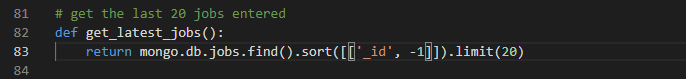

### Bugs found:  
1. Try to sort job list by date, with the last jobs on the top of the list.

1. steps to trigger the behavior:
    1. go to https://build-connected.herokuapp.com/
    1. log in or register to access the website
    1. the homepage is displayed with the jobs not properly sorted by date
     
1. In the homepage the latest jobs added are sorted using the date jobs were entered. The sorting works for the day but not for the month.

1. Solve the issue by using ObjectId to sort the jobs  
