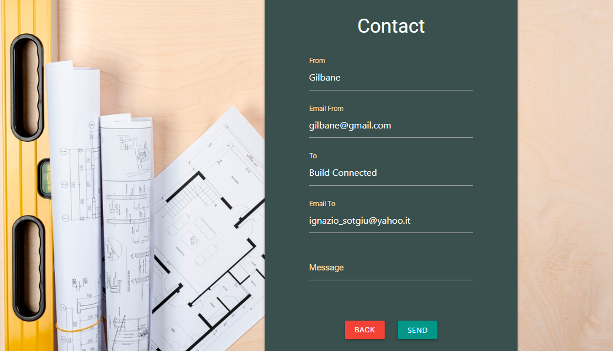

## Build connected user stories

Find the user stories [here](user-stories.pdf)  
Find the trade-offs [here](trade-offs.pdf)

* As a User I want to register to the website  
 
* As a User I want to login to the website 
 
* As a User I want to have more information about the website before registering 
 
* As a User I want to edit information on my profile  
 
* As a User I want to delete my profile  
 
* As a User I want to add a location of where my company is based  

* As a User I want to perform a search for other users/companies based on category    
* As a User I want to perform a search for other users/companies based on their name  
* As a User I want to perform a search for other users/companies based on their location 

* As a User I want to contact other users/companies  
  
* As a User I want to add jobs on the jobs database  

* As a User I want to edit jobs that I entered

* As a User I want to delete jobs that I entered

* As a User I want to search for jobs based on a county  
* As a User I want to search for jobs based on a category  
* As a User I want to search for jobs based on employer company/user

* As a User I want to apply for jobs  throgh contact email provided
   
* As a Owner I want create a website to connect Main-contractors with Sub-contractors  

* As a Owner I want users to share information on my website  
 
* As a Owner I want registered user to access information on database  
  
* As a Owner I want users to give information about the value the platform provides  

* As a Owner I want registered users to perform actions adding, deleting, editing their entries  

* As a Owner I want registered users to perform actions deleting, editing their profile  

* As a Owner I want to have an admin profile to access and manage the data in the database  

* As a Owner I want to be able to search, edit, delete entries in the jobs database  

* As a Owner I want to be able to search and delete entries in the users database  

* As a Owner I want my website to give feedback after user actions

